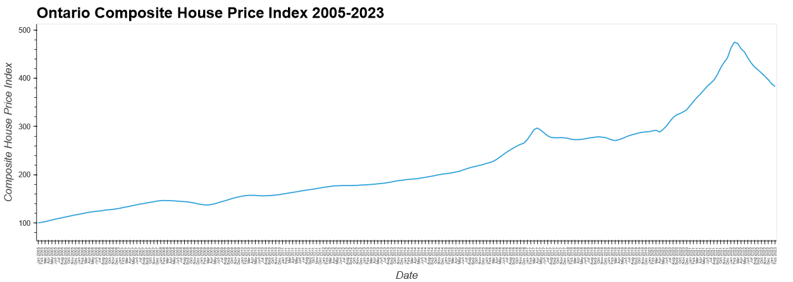
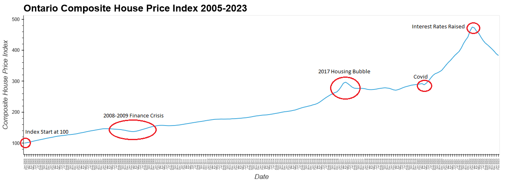
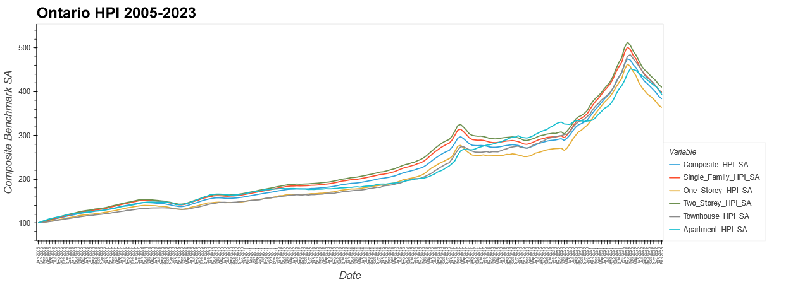
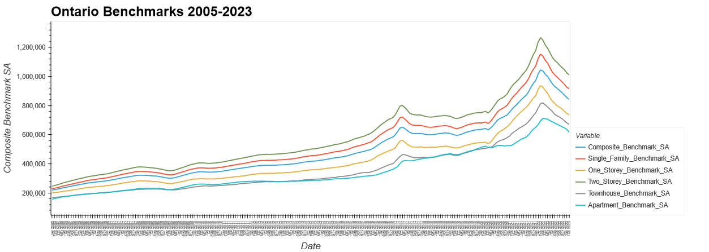
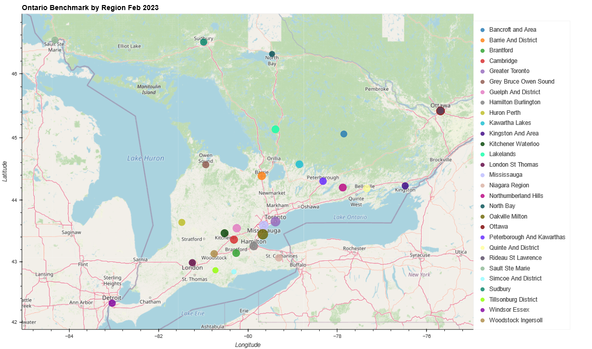
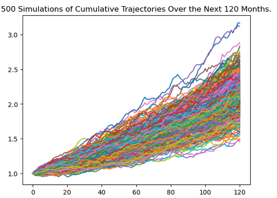

# FintechBootcampProject3
Project 3 for Fintech Bootcamp 

## Contributors
- Jamie Mellway
- Josh Esteban
- Majeed Raheem
- Joey Falvo
- Rafi Nazamodeen

## Project 1 Redux
Analyzing Ontario Real Estate data for trends (monthly and regional) and projected trends.

### Dependencies
This project utilizes the following packages:
- [Python 3.7](https://www.python.org/)
- [NumPy 1.23.5](https://numpy.org/)
- [pandas 2.0.1](https://pandas.pydata.org/)
- [hvPlot 0.8.3](https://hvplot.holoviz.org/)
- [GeoPy 2.3.0](https://pypi.org/project/geopy/)
- [streamlit 1.9.0](https://pypi.org/project/streamlit/)

### 1. What are the trends for Ontario real estate for 2005-2023? (Monthly)

### 2. What are the trends for Ontario real estate for 2005-2023? (Regional)

### 3. Where is the housing market trending? 

There is a 95% chance that an initial real estate investment of $1,000,000 over the next 10 years will end within in the range of $1,661,548.91 and $2,690,245.89.

## Project 2 Redux
This project uses neural networks to create a model that predicts Ontario housing prices. The model is used through an Amazon Lex chatbot that allows the user to pick a region in Ontario and a building type that they are interested in. The chatbot gives the user the option to choose a date for the price as well.

### Background
There are many contributing factors to Ontario's housing market. Housing prices fluctuate due to many market forces making this a regression problem. This project aims to take data that is relevant to the market and create a neural network that can predict the housing prices.

### Dependencies
This project utilizes the following packages:
- [Python 3.7](https://www.python.org/)
- [NumPy 1.23.5](https://numpy.org/)
- [pandas 2.0.1](https://pandas.pydata.org/)
- [hvPlot 0.8.3](https://hvplot.holoviz.org/)
- [scikit-learn 1.2.2](https://scikit-learn.org/stable/)
- [TensorFlow 2.12.0](https://www.tensorflow.org/)
- [Keras 2.12.0](https://keras.io/)
- [streamlit 1.9.0](https://pypi.org/project/streamlit/)
- [streamlit-chat 0.1.1](https://pypi.org/project/streamlit-chat/)

### Data
Data was collected and analyzed to create the best model. Altogether, there are 13 features and 161 predictors, each with 176 data points.

#### Collection
Actual housing price data was found from CREA. These are our ground truth data that we want to predict. Our feature data was found from various sites covering data that we felt would be relevant to housing prices. These include: Yahoo Finance, Macrotrends, Statistics Canada, and Bank of Canada.

[Lumber Prices](https://www.macrotrends.net/2637/lumber-prices-historical-chart-data)    
[iShares Global Timber & Forestry ETF](https://finance.yahoo.com/quote/WOOD/history?p=WOOD)    
[SPDR S&P Homebuilders ETF](https://finance.yahoo.com/quote/XHB/history?p=XHB)   
[iShares U.S. Home Construction ETF](https://finance.yahoo.com/quote/ITB/history?p=ITB)    
[Consumer Price Index](https://www150.statcan.gc.ca/t1/tbl1/en/tv.action?pid=1810000601&cubeTimeFrame.startMonth=12&cubeTimeFrame.startYear=2005&cubeTimeFrame.endMonth=04&cubeTimeFrame.endYear=2023&referencePeriods=20051201%2C20230401)    
[Interest rates](https://www.bankofcanada.ca/rates/interest-rates/canadian-interest-rates/) 

#### Analysis
Some data from our CPI set was duplicate, didn't add any value and led to overfitting. We isolated the data and removed it from our set.
Removed data:
- All-items 8
- All-items excluding food
- All-items excluding food and energy

### Description
The neural network used to create the model has the following characteristics:

#### Parameters

#### Evaluation
|Metric|Value|
|:---|---:|
|R-Squared (train)|0.9974559414984706|
|R-Squared|0.988579310366157|
|Mean Absolute Error|0.06405685077016317|
|Mean Absolute Percentage Error|24.720600483659982|
|Mean Squared Error|0.010621614314503598|
|Root Mean Squared Error|0.1030612163449646|

#### Graphical Results

### Usage
The user can interact with an Amazon Lex chatbot that will give them the price of a house in their desired location and building type for a given date. Also, the python notebooks can be run as is, to create the model and make predictions.

## Project 3
### Buying and Selling Property
This app allows a user to list and buy properties.

### Dependencies
This project utilizes the following packages:
- [streamlit 1.23.1](https://pypi.org/project/streamlit/)
- [boto3 1.24.28](https://boto3.amazonaws.com/v1/documentation/api/latest/index.html)
- [Web3 6.8.0](https://web3py.readthedocs.io/en/stable/)
- [python-dotenv 0.21.1](https://pypi.org/project/python-dotenv/)
- [requests 2.28.1](https://pypi.org/project/requests/)
- [geopy 2.3.0](https://pypi.org/project/geopy/)
- [pydeck 0.8.1b0](https://pypi.org/project/pydeck/)

#### How it works
A user will list their property for sale. The information associated with the property is stored on [Piñata](https://www.pinata.cloud/), including images. An [OpenZeppelin ERC721](https://docs.openzeppelin.com/contracts/2.x/erc721) token is created for the property. All contracts are coded with [Solidity](https://soliditylang.org/) in [Remix](https://remix.ethereum.org/).

The token contract inherits ERC721 as well as a custom contract for transfering Ether from buyer to seller through the contract.

#### Selling/Listing    
1. Click on the 'List Property' option from the drop-down in the sidebar.
2. Fill in all the information including adding pictures of your property.
3. Click 'List!'

#### Buying    
1. Click on the 'Buy Property' option from the drop-down in the sidebar.
2. Fill in all the information.
3. Click on 'Buy'

## Public Website
Our public website is https://ontariohousingmarketanalysis.streamlit.app/ and it contains some of our pages.

## Environment Setup
See [InstallationNotes.txt](InstallationNotes.txt), [packages.txt](packages.txt), and [requirements.txt](streamlit/requirements.txt)

## Demos
To run our demos us (from the streamlit folder):

streamlit run home.py

streamlit run home_buynsell.py

## Summary of the analysis
See [Presentation1.pptx](Presentation1.pptx), [Presentation2.pptx](Presentation2.pptx), and [Presentation3.pptx](Presentation3.pptx)
